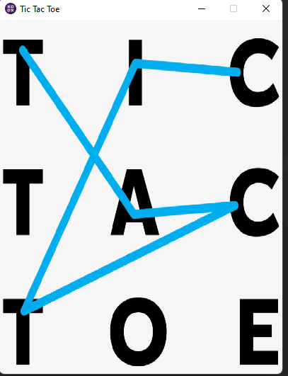
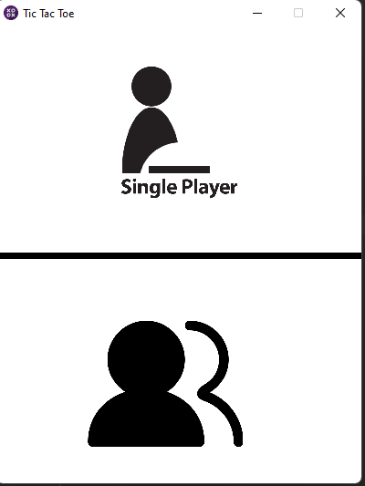
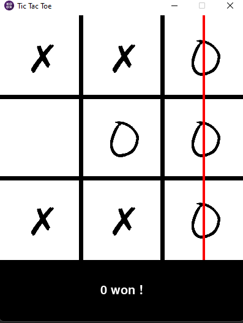
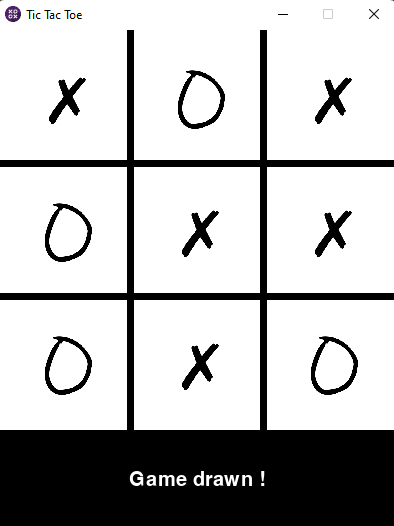

# <h2>tictactoeGUI </h2>
The GUI version of the game tic-tac-toe has two modes: 
  **Single Player** - The user plays against the computer.  
  **Multi Player** - Two users can play with each other.  
The command-line version of the game tic-tac-toe and only **Multi Player** mode.
  

<td>
<tr>
  <td></td>
  <td></td>
</tr>
<tr>
  <td></td>
  <td></td>
</tr>
</td>

<h2>License 
</h2>
This repository is released under the MIT license. In short, this means you are free to use this software in any personal, open-source or commercial projects. Attribution is optional but appreciated.
